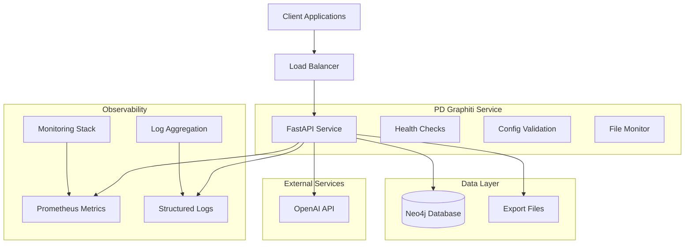

# PD Graphiti Service

**Parkinson's Disease Target Discovery Knowledge Graph Service**

A production-ready FastAPI service for managing and querying knowledge graphs related to Parkinson's Disease research, with comprehensive monitoring, structured logging, and operational features.

[](./docker/)
[](http://localhost:8000/docs)
[](http://localhost:8000/metrics)
[](#logging)

## 🚀 Quick Start

### Prerequisites

- Docker Engine 20.10+ and Docker Compose V2
- OpenAI API key
- At least 4GB RAM available

### 1-Minute Setup

```bash
# Clone and setup
git clone <repository-url>
cd pd-graphiti-service

# Configure environment
cp docker/env.template docker/.env
# Edit docker/.env with your OpenAI API key

# Deploy
cd docker && ./deploy.sh dev

# Verify deployment
curl http://localhost:8002/health/live
curl http://localhost:8002/metrics
```

**🎉 Service will be available at:**
- **API**: http://localhost:8002
- **Docs**: http://localhost:8002/docs
- **Metrics**: http://localhost:8002/metrics
- **Neo4j Browser**: http://localhost:7475

## 📋 Table of Contents

- [Features](#-features)
- [Architecture](#-architecture)
- [Installation](#-installation)
- [Configuration](#-configuration)
- [API Documentation](#-api-documentation)
- [Monitoring & Logging](#-monitoring--logging)
- [Deployment](#-deployment)
- [Development](#-development)
- [Troubleshooting](#-troubleshooting)
- [Contributing](#-contributing)

## ✨ Features

### Core Functionality
- **Knowledge Graph Management**: Create, query, and manage PD research knowledge graphs
- **Episode Ingestion**: Process and ingest research data episodes
- **File Monitoring**: Automated monitoring and processing of data files
- **Export Management**: Handle data exports and transformations

### Operational Excellence
- **Structured Logging**: JSON-formatted logs with request correlation
- **Prometheus Metrics**: Comprehensive monitoring with 20+ metrics
- **Health Checks**: Liveness, readiness, and deep health endpoints
- **Configuration Validation**: Startup validation with clear error messages
- **Error Tracking**: Detailed error tracking with correlation IDs

### Production Ready
- **Docker Support**: Multi-stage builds with security hardening
- **Container Orchestration**: Kubernetes manifests and health checks
- **Monitoring Integration**: Prometheus, Grafana, and custom metrics
- **Development Tools**: Hot reload, debugging, and testing support

## 🏗️ Architecture



### Component Overview

| Component | Purpose | Technology |
|-----------|---------|------------|
| **FastAPI Service** | REST API and business logic | FastAPI, Python 3.12 |
| **Neo4j Database** | Knowledge graph storage | Neo4j 5.26.2 |
| **Graphiti Client** | Graph operations and AI integration | Graphiti Core |
| **File Monitor** | Automated file processing | Watchdog |
| **Prometheus Metrics** | Application and system monitoring | Prometheus Client |
| **Structured Logging** | Request tracking and debugging | Structlog |

## 📦 Installation

### Option 1: Docker (Recommended)

**Development Environment:**
```bash
# Clone repository
git clone <repository-url>
cd pd-graphiti-service

# Setup environment
cp docker/env.template docker/.env
nano docker/.env  # Add your OpenAI API key

# Deploy development stack
cd docker
./deploy.sh dev
```

**Production Environment:**
```bash
# Setup production directories
sudo mkdir -p /opt/pd-graphiti/{data/neo4j,logs}
sudo chown -R 1001:1001 /opt/pd-graphiti

# Configure production environment
cp docker/env.template docker/.env
# Configure with production values

# Deploy production stack
./deploy.sh prod
```

### Option 2: Local Development

**Prerequisites:**
- Python 3.12+
- Neo4j 5.26+
- uv package manager

```bash
# Install dependencies
uv sync

# Setup environment
cp docker/env.template .env
# Configure environment variables

# Start Neo4j (separate terminal)
neo4j console

# Run development server
uv run uvicorn src.pd_graphiti_service.main:app --reload --host 0.0.0.0 --port 8000
```

### Option 3: pip Installation

```bash
# Install from source
pip install -e .

# Or install from PyPI (when published)
pip install pd-graphiti-service
```

## ⚙️ Configuration

### Environment Variables

| Variable | Required | Default | Description |
|----------|----------|---------|-------------|
| **OPENAI_API_KEY** | ✅ | - | OpenAI API key for AI operations |
| **NEO4J_PASSWORD** | ✅ | - | Neo4j database password |
| **NEO4J_URI** | ❌ | `bolt://localhost:7687` | Neo4j connection string |
| **NEO4J_USER** | ❌ | `neo4j` | Neo4j username |
| **GRAPHITI_GROUP_ID** | ❌ | `pd_target_discovery` | Knowledge graph group identifier |
| **LOG_LEVEL** | ❌ | `INFO` | Logging level (DEBUG/INFO/WARNING/ERROR) |
| **LOG_FORMAT** | ❌ | `json` | Log format (json/console) |
| **ENABLE_MONITORING** | ❌ | `true` | Enable Prometheus metrics |
| **SERVICE_PORT** | ❌ | `8000` | Application port |
| **METRICS_PORT** | ❌ | `8001` | Metrics port |

### Configuration Files

**Docker Environment:**
```bash
# docker/.env
OPENAI_API_KEY=sk-your-key-here
NEO4J_PASSWORD=your-secure-password
LOG_LEVEL=INFO
ENABLE_MONITORING=true
```

**Application Settings:**
Settings are automatically loaded from environment variables using Pydantic Settings. See `src/pd_graphiti_service/config.py` for all available options.

### Validation

The service validates configuration at startup:

```bash
# Check configuration
curl http://localhost:8002/health/ready

# View validation details
docker logs pd-graphiti-service | grep "validation"
```

## 📚 API Documentation

### Interactive Documentation

- **Swagger UI**: http://localhost:8002/docs
- **ReDoc**: http://localhost:8002/redoc
- **OpenAPI Spec**: http://localhost:8002/openapi.json

### Core Endpoints

#### Health & Status

```bash
# Liveness check (fast)
GET /health/live
# Response: {"status": "alive", "timestamp": "2025-01-01T00:00:00Z"}

# Readiness check (validates dependencies)
GET /health/ready
# Response: {"status": "ready", "services": {...}}

# Deep health check (comprehensive)
GET /health/deep
# Response: {"status": "healthy", "connection_tests": {...}}

# Service information
GET /
# Response: {"service": "PD Graphiti Service", "version": "0.1.0", ...}
```

#### Monitoring

```bash
# Prometheus metrics
GET /metrics
# Response: Prometheus-formatted metrics

# Custom metrics with system stats
GET /api/v1/metrics
# Response: {"metrics": {"system": {...}, "application": {...}}}
```

#### Ingestion API

```bash
# Process data episode
POST /api/v1/ingest
Content-Type: application/json
{
  "source": "research_paper",
  "data": {...},
  "metadata": {...}
}

# Get ingestion status
GET /api/v1/ingest/{task_id}

# List background tasks
GET /api/v1/tasks
```

### API Examples

#### Curl Examples

```bash
# Health check
curl -X GET "http://localhost:8002/health/live"

# Get metrics
curl -X GET "http://localhost:8002/metrics"

# Process data (example)
curl -X POST "http://localhost:8002/api/v1/ingest" \
  -H "Content-Type: application/json" \
  -d '{
    "source": "pubmed",
    "data": {
      "title": "New insights into PD pathology",
      "abstract": "This study investigates...",
      "authors": ["Smith, J.", "Doe, A."]
    },
    "metadata": {
      "doi": "10.1234/example",
      "publication_date": "2024-01-01"
    }
  }'
```

#### Python Examples

```python
import httpx
import asyncio

async def health_check():
    async with httpx.AsyncClient() as client:
        response = await client.get("http://localhost:8002/health/live")
        return response.json()

async def get_metrics():
    async with httpx.AsyncClient() as client:
        response = await client.get("http://localhost:8002/api/v1/metrics")
        return response.json()

async def ingest_data():
    data = {
        "source": "research_paper",
        "data": {
            "title": "Novel PD biomarkers",
            "content": "Research findings..."
        }
    }
    
    async with httpx.AsyncClient() as client:
        response = await client.post(
            "http://localhost:8002/api/v1/ingest",
            json=data
        )
        return response.json()

# Run examples
print(asyncio.run(health_check()))
print(asyncio.run(get_metrics()))
```

#### JavaScript Examples

```javascript
// Health check
const healthCheck = async () => {
  const response = await fetch('http://localhost:8002/health/live');
  return await response.json();
};

// Get system metrics
const getMetrics = async () => {
  const response = await fetch('http://localhost:8002/api/v1/metrics');
  return await response.json();
};

// Ingest data
const ingestData = async (data) => {
  const response = await fetch('http://localhost:8002/api/v1/ingest', {
    method: 'POST',
    headers: {
      'Content-Type': 'application/json',
    },
    body: JSON.stringify(data)
  });
  return await response.json();
};
```

### Response Formats

#### Success Response
```json
{
  "status": "success",
  "data": {...},
  "timestamp": "2025-01-01T00:00:00Z",
  "request_id": "abc123"
}
```

#### Error Response
```json
{
  "error": "Validation Error",
  "detail": "Invalid input format",
  "error_id": "err_xyz789",
  "path": "/api/v1/ingest",
  "timestamp": "2025-01-01T00:00:00Z"
}
```

## 📊 Monitoring & Logging

### Prometheus Metrics

The service exposes comprehensive metrics at `/metrics`:

#### Application Metrics
- `pd_graphiti_ingestion_requests_total` - Total ingestion requests
- `pd_graphiti_ingestion_duration_seconds` - Request processing time
- `pd_graphiti_episodes_processed_total` - Episodes processed
- `pd_graphiti_ingestion_failures_total` - Processing failures

#### Knowledge Graph Metrics
- `pd_graphiti_knowledge_graph_nodes_total` - Graph nodes
- `pd_graphiti_knowledge_graph_edges_total` - Graph edges
- `pd_graphiti_knowledge_graph_entities_total` - Entities by type

#### System Metrics
- `pd_graphiti_memory_usage_bytes` - Memory usage
- `pd_graphiti_cpu_usage_percent` - CPU utilization
- `pd_graphiti_health_check_status` - Service health

### Structured Logging

All logs are output in structured JSON format:

```json
{
  "timestamp": "2025-01-01T00:00:00Z",
  "level": "info",
  "event": "request_completed",
  "service": "pd-graphiti-service",
  "version": "0.1.0",
  "request_id": "abc123",
  "method": "GET",
  "path": "/health/live",
  "status_code": 200,
  "duration_seconds": 0.001,
  "client_ip": "192.168.1.100"
}
```

#### Log Levels

- **DEBUG**: Detailed debugging information
- **INFO**: General operational messages
- **WARNING**: Warning conditions
- **ERROR**: Error conditions with stack traces
- **CRITICAL**: Critical system failures

### Monitoring Integration

#### Prometheus Configuration

```yaml
# prometheus.yml
scrape_configs:
  - job_name: 'pd-graphiti-service'
    static_configs:
      - targets: ['localhost:8002']
    metrics_path: '/metrics'
    scrape_interval: 30s
```

#### Grafana Dashboard

Example dashboard panels:
- Request rate and response time
- Memory and CPU usage
- Knowledge graph growth
- Error rates by endpoint
- Health check status

## 🚀 Deployment

### Docker Deployment

See [Docker Deployment Guide](./docker/README.md) for detailed instructions.

**Quick Commands:**
```bash
# Development
./docker/deploy.sh dev

# Production  
./docker/deploy.sh prod

# With custom configuration
docker-compose -f docker-compose.yml -f docker-compose.prod.yml up -d
```

### Kubernetes Deployment

See [Kubernetes Deployment Guide](./kubernetes/README.md) for complete manifests.

### Production Checklist

- [ ] Configure environment variables
- [ ] Set up SSL/TLS certificates
- [ ] Configure monitoring stack
- [ ] Set up log aggregation
- [ ] Configure backup procedures
- [ ] Set up alerting rules
- [ ] Perform load testing
- [ ] Configure rate limiting
- [ ] Set up CI/CD pipeline

## 🛠️ Development

### Local Development Setup

```bash
# Install dependencies
uv sync --dev

# Pre-commit hooks
pre-commit install

# Run tests
pytest

# Start development server with hot reload
uv run uvicorn src.pd_graphiti_service.main:app --reload
```

### Testing

```bash
# Run all tests
pytest

# Run with coverage
pytest --cov=src/pd_graphiti_service

# Run specific test file
pytest tests/test_main.py

# Run integration tests
pytest tests/integration/
```

### Code Quality

```bash
# Format code
black src/
isort src/

# Lint code
flake8 src/
mypy src/

# Security check
bandit -r src/
```

## 🔧 Troubleshooting

### Common Issues

#### Service Won't Start

**Symptoms**: Container restarts or exits immediately

**Diagnosis:**
```bash
# Check logs
docker logs pd-graphiti-service

# Check configuration
docker exec pd-graphiti-service env | grep -E "(OPENAI|NEO4J)"

# Validate configuration
curl http://localhost:8002/health/ready
```

**Solutions:**
1. **Missing API Key**: Set `OPENAI_API_KEY` in environment
2. **Neo4j Connection**: Verify `NEO4J_URI` and credentials
3. **Port Conflicts**: Check ports 8000/8001 are available
4. **Memory Issues**: Increase Docker memory allocation

#### API Endpoints Return 500 Errors

**Symptoms**: Internal server errors on API calls

**Diagnosis:**
```bash
# Check application logs
docker logs pd-graphiti-service | grep -i error

# Check health endpoints
curl http://localhost:8002/health/deep

# Monitor metrics
curl http://localhost:8002/metrics | grep error
```

**Solutions:**
1. **Database Issues**: Verify Neo4j connectivity
2. **OpenAI Issues**: Check API key and quotas
3. **Memory Issues**: Monitor memory usage metrics
4. **Configuration**: Validate all environment variables

#### Performance Issues

**Symptoms**: Slow response times, high resource usage

**Diagnosis:**
```bash
# Monitor system metrics
curl http://localhost:8002/api/v1/metrics

# Check resource usage
docker stats pd-graphiti-service

# Review request timings
docker logs pd-graphiti-service | grep duration_seconds
```

**Solutions:**
1. **Memory**: Increase container memory limits
2. **CPU**: Scale horizontally or increase CPU allocation
3. **Database**: Optimize Neo4j configuration
4. **Caching**: Implement response caching

#### Neo4j Connection Issues

**Symptoms**: Database connection failures

**Diagnosis:**
```bash
# Test Neo4j directly
docker exec pd-neo4j cypher-shell -u neo4j -p password "RETURN 1"

# Check network connectivity
docker exec pd-graphiti-service nc -zv neo4j 7687

# Review connection logs
docker logs pd-graphiti-service | grep -i neo4j
```

**Solutions:**
1. **Authentication**: Verify username/password
2. **Network**: Check Docker network configuration
3. **Firewall**: Ensure ports 7687/7474 are accessible
4. **Memory**: Increase Neo4j heap size

### Log Analysis

#### Finding Request Issues
```bash
# Filter by request ID
docker logs pd-graphiti-service | jq '.request_id == "abc123"'

# Filter by status code
docker logs pd-graphiti-service | jq '.status_code >= 400'

# Monitor error rates
docker logs pd-graphiti-service | jq -s 'group_by(.status_code) | map({status: .[0].status_code, count: length})'
```

#### Performance Analysis
```bash
# Slowest requests
docker logs pd-graphiti-service | jq -s 'sort_by(.duration_seconds) | reverse | .[0:10]'

# Average response times by endpoint
docker logs pd-graphiti-service | jq -s 'group_by(.path) | map({path: .[0].path, avg_duration: (map(.duration_seconds) | add / length)})'
```

### Debugging Tips

1. **Enable Debug Logging**: Set `LOG_LEVEL=DEBUG`
2. **Use Request IDs**: Track requests across logs
3. **Monitor Metrics**: Watch for patterns in metrics
4. **Health Checks**: Use deep health check for diagnostics
5. **Error Tracking**: Follow error IDs for detailed traces

### Getting Help

1. **Documentation**: Check this README and [deployment guides](./docker/)
2. **Logs**: Enable debug logging and check structured logs
3. **Metrics**: Monitor `/metrics` and `/api/v1/metrics` endpoints
4. **Health Checks**: Use `/health/deep` for comprehensive diagnostics
5. **Issues**: Open GitHub issues with logs and configuration

## 🤝 Contributing

### Development Workflow

1. Fork the repository
2. Create a feature branch
3. Make changes with tests
4. Run quality checks
5. Submit pull request

### Code Standards

- **Python**: Follow PEP 8, use Black formatter
- **Documentation**: Update README and docstrings
- **Tests**: Add tests for new features
- **Logging**: Use structured logging with context
- **Metrics**: Add monitoring for new features

### Release Process

1. Update version in `pyproject.toml`
2. Update CHANGELOG.md
3. Create release tag
4. Build and publish Docker image
5. Update deployment documentation

---

## 📄 License

This project is licensed under the MIT License - see the [LICENSE](LICENSE) file for details.

## 🙋 Support

- **Documentation**: [Complete deployment guides](./docker/)
- **API Reference**: http://localhost:8002/docs
- **Monitoring**: http://localhost:8002/metrics
- **Issues**: GitHub Issues
- **Discussions**: GitHub Discussions

---

**Built with ❤️ for Parkinson's Disease research**
